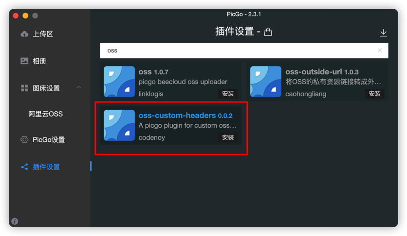
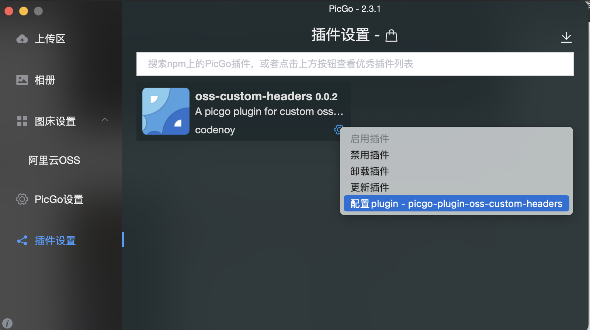
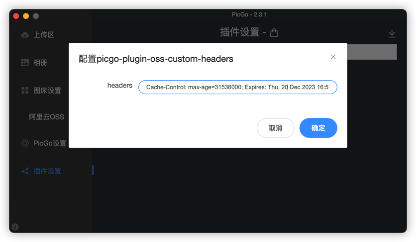

## picgo-plugin-oss-custom-headers

A plugin for picgo to custom oss put headers

picgo 客户端不支持设置阿里云 OSS 图片上传的元信息(请求头 headers), 使用阿里云 OSS 做图床的用户需要手动到 OSS 控制台给`bucket`里的图片设置缓存头, 本插件仅支持给阿里云 OSS 图床添加缓存 Headers.

**在 picgo 客户端搜索插件**:



**安装之后, 点击插件设置 Headers**:



**设置缓存 Headers**:

```txt
Cache-Control: max-age=31536000; Expires: Thu, 20 Dec 2023 16:57:08 GMT
```

请求头之间使用分号`;`隔开, 类似`k:v;k:v`
阿里云 OSS 可以自定义的用户元信息(headers)只有几个, 经我使用体验, 只有`Cache-Control`和`Expires`是有用的, 所以 headers 设置目前只支持这两个请求头, 参考[阿里云文档](https://help.aliyun.com/zh/oss/user-guide/manage-object-metadata-10)



推荐使用缓存头, 缓存一年:

```
Cache-Control: max-age=31536000;
```

## 在 Node.js 中使用插件

```js
const { PicGo } = require("picgo");
const ossCustomPlugin = require("picgo-plugin-oss-custom-headers");
// register plugin
picgo.use(ossCustomPlugin, "picgo-plugin-oss-custom-headers");
// set plugin config
picgo.setConfig({
  "picgo-plugin-oss-custom-headers": {
    headers:
      "Cache-Control: max-age=31536000; Expires: Thu, 20 Dec 2023 16:57:08 GMT",
  },
});
```

## Debug

如何调试插件:

需要在`.env`文件添加关于 aliyun 的配置, 具体字段和`picgo`软件中`阿里云OSS`的配置一致

```sh
accessKeyId=
accessKeySecret=
bucket=
area=
path=
customUrl=
option=
```

配置好.env 后,执行`npm run test`即可调试
